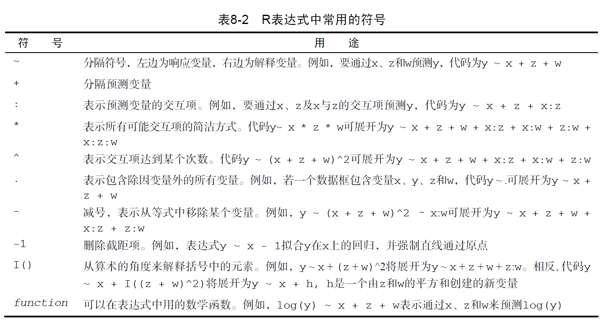
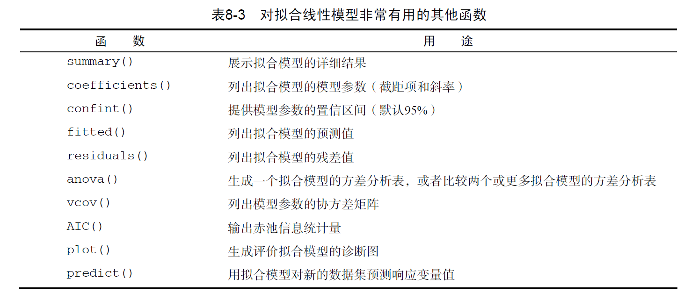
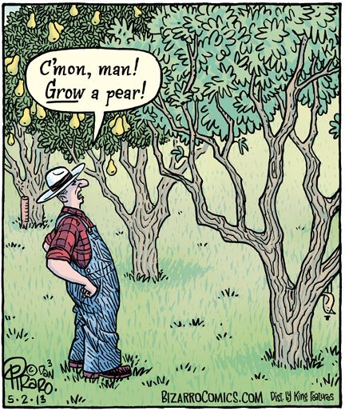

class: middle, center
## Regression Analysis

---

```{r setup, include=FALSE}
options(htmltools.dir.version = FALSE)
```

class: center, middle, inverse

# Agenda 1: Disscusion

---
class: middle

# How to use lm()



---
class: middle

# How to use lm()



---
class:  middle


```{r echo=TRUE}

G1 <- c("徐文聪", "杜辉", "郭思坤", "陈心怡", "杜婧雯", "董宸", "姚瑶")
G2 <- c("胡粲", "吴晴歌", "陈玉宁", "肖辅", "徐盛", "吴玄慧", "杨颖超")
G3 <- c("关晓彤", "陶蕴华", "李颖", "王勇", "谢波", "魏华", "乌尼尔")
G4 <- c("肖静", "王引梅", "汪菲菲", "宗鑫", "左紫薇", "万启慧","吴琦")
G5 <- c("张景志", "姜瀛博", "谢永乐", "张朝霞", "汪丽华", "王丹洋", "黄鑫")
G6 <- c("李春", "肖伊人", "黄梦涵", "苏碧俏", "田世龙", "夏显霖")
G7 <- c("王俊杰", "肖礼万", "樊鲁玉", "王一洋", "武越" ,"韦彤")
```

---

class:  center, middle

# Homework Assign

```{r echo=FALSE}

# (assign <- data.frame(homework = c("1", "2", "3", "4", "5","6.1 & 6.2 & 6.3", "6.4"), group = sample(1:7)))

```

---
class: center, middle, inverse

# Agenda 2: Report

---
class: center, middle
homowork-1


```{r echo=FALSE}
# sample(get(paste0("G", assign$group[1])),1)
```

---
class: middle

```{r echo=TRUE, message=FALSE, warning=FALSE, paged.print=FALSE}
# homowork-1: R-code
data_1 <- read.table("homework-6.1-data.txt", header = F, 
                     col.names = c("Number", "Height", "Weight", "Lung"))
fit_1 <- lm(Lung ~ Height + Weight, data = data_1)
summary(fit_1)
# y=-0.565664+0.005017x_1+0.054061x_2
```

---
class: middle

homowork-1: R-code

```{r echo=TRUE, fig.height=7, fig.width=12, message=FALSE, warning=FALSE, paged.print=FALSE}
# homowork-1: R-code
# library(car)
# scatterplotMatrix(data_1[2:4])
par(mfrow= c(2,2))
plot(fit_1)

```

---
class: center, middle

homowork-2


```{r echo=FALSE}
# sample(get(paste0("G", assign$group[2])),1)
```

---
class: middle

```{r echo=TRUE, message=FALSE, warning=FALSE, paged.print=FALSE}
# homowork-2: R-code
data_2 <- read.table("homework-6.2-data.txt", header = T)
fit_2 <- lm(y~x1+ x2, data = data_2)
summary(fit_2)
# y=-0.591+22.387x_1+327.672x_2
```

---
class: middle

```{r echo=TRUE, fig.height=5, fig.width=12, message=FALSE, warning=FALSE, paged.print=FALSE}
# homowork-2: R-code
par(mfrow= c(2,2))
plot(fit_2)
confint(fit_2, level=0.95)
```

---
class: center, middle

homowork-3


```{r echo=FALSE}
# sample(get(paste0("G", assign$group[3])),1)
```

---
class: middle

```{r echo=TRUE, fig.height=5, fig.width=12, message=FALSE, warning=FALSE, paged.print=FALSE}
# homowork-3.1: R-code
data_3 <- read.table("homework-6.3-winequality-red.csv", sep = ",", header = T)
head(data_3, n=2)
summary(data_3)[,1:4]
```


---
class: middle

```{r echo=TRUE,  fig.height=7, fig.width=12, message=FALSE, warning=FALSE, paged.print=FALSE}
# homowork-3.2: R-code
par(mfrow=c(1,2))
hist(data_3$fixed.acidity, 
     main="the distribution of fixed acidity",xlab="volatile.acidity")
plot(data_3$quality,data_3$volatile.acidity,
     main="quality vs volatile acidity",xlab="quality",ylab="volatile.acidity")
```

---
class: middle

```{r echo=TRUE, fig.height=5, fig.width=12, message=FALSE, warning=FALSE, paged.print=FALSE}
# homowork-3.3 & 3.4: R-code
apply(data_3,2,function(x)cor(x,data_3$quality))
(shapiro.test(data_3$alcohol))$p.value
(shapiro.test(data_3$quality))$p.value
(kruskal.test(data_3$alcohol ~ data_3$quality))$p.value
```

---
class: middle

```{r echo=TRUE, fig.height=5, fig.width=12, message=FALSE, warning=FALSE, paged.print=FALSE}
# homowork-3.5: R-code
fit_3 <- lm(quality ~ ., data=data_3)
summary(fit_3)
```

---
class: center, middle

homowork-4


```{r echo=FALSE}
# sample(get(paste0("G", assign$group[4])),1)
```

---
class: middle

```{r echo=TRUE, fig.height=5, fig.width=12, message=FALSE, warning=FALSE, paged.print=FALSE}
# homowork-4.1: R-code
data_4 <- read.table("homework-6.4-data.txt", sep = ",", header = T)
fit_4 <- glm(y~ Income + Age, data = data_4, family = binomial())
summary(fit_4)
```

---
class: middle

```{r echo=TRUE, fig.height=5, fig.width=12, message=FALSE, warning=FALSE, paged.print=FALSE}
# homowork-4.2 & 4.3: R-code
### 4.2
coef(fit_4)
### 4.3
predict(fit_4, data.frame(Income = 45000, Age = 5), type = "response")
### odds= expa(0.597610-1.496084x_1-0.001595x_2+0.315865x_3)
```

---
class: center, middle

homowork-5


```{r echo=FALSE}
# sample(get(paste0("G", assign$group[5])),1)
```


---
class: middle

```{r echo=TRUE,message=FALSE, warning=FALSE, paged.print=FALSE}
# homowork-5.1: R-code
data_5 <- read.table("homework-6.5-Drivers.csv", sep = ",", header = T)
fit_5 <- glm(y ~ x1 + x2 + x3, data = data_5, family=binomial())
(summary(fit_5))$coefficients
### odds=exp(0.597610-1.496084x_1-0.001595x_2+0.315865x_3)
```

---
class: middle

```{r echo=TRUE, message=FALSE, warning=FALSE, paged.print=FALSE}
# homowork-5.2: R-code
fit_5_x1 <- glm(y ~ x1 , data = data_5, family=binomial())
summary(fit_5_x1)
### p=(exp(0.6190-1.3728x_1))/(1+expa(0.6190-1.3728x_1))
```

---
class: middle

```{r echo=TRUE, message=FALSE, warning=FALSE, paged.print=FALSE}
# homowork-5.3: R-code
predict(fit_5_x1, data.frame(x1 = c(0, 1)), type = "response")
```

---
class: center, middle

homowork-6.1 & 6.2 & 6.3


```{r echo=FALSE}
# sample(get(paste0("G", assign$group[6])),1)
```

---
class: middle

```{r echo=TRUE, message=FALSE, warning=FALSE, paged.print=FALSE}
# homowork-6.1: R-code
data_6 <- read.table("homework-6.6-data.csv", sep = ",", header = T)
### 6.1
data_6$diagnosis[data_6$diagnosis == "M"] <- 1
data_6$diagnosis[data_6$diagnosis == "B"] <- 0
data_6$diagnosis <- factor(data_6$diagnosis, levels = c(0, 1), labels = c("B", "M"))
fit_6_1 <- glm(diagnosis ~ ., data = data_6[, c(2:12)], family = binomial())
(summary(fit_6_1))$coefficients
```

---
class: middle

```{r echo=TRUE, message=FALSE, warning=FALSE, paged.print=FALSE}
# homowork-6.2 & 6.3: R-code
### 6.2
fit_6_2 <- glm(diagnosis ~ ., data = data_6[, c('diagnosis' ,'texture_mean','area_mean','smoothness_mean','concave.points_mean')], family = binomial())
(summary(fit_6_2))$coefficients
### 6.3
anova(fit_6_1, fit_6_2, test="Chisq")
```


---
class: center, middle

homowork-6.4


```{r echo=FALSE}
# sample(get(paste0("G", assign$group[7])),1)
```

---
class: middle

```{r echo=TRUE, message=FALSE, warning=FALSE, paged.print=FALSE}
# homowork-6.4: R-code
train_data <- data_6[1:398,]
test_data <- data_6[399:nrow(data_6),]
fit_train <- glm(diagnosis ~ ., data = train_data[, c('diagnosis',
                 'texture_mean', 'area_mean', 'smoothness_mean', 'concave.points_mean')], family = binomial())
test <- predict(fit_train, test_data[, c('diagnosis',
                 'texture_mean', 'area_mean', 'smoothness_mean', 'concave.points_mean')], type = "response")
test[test >= 0.5] <- 1
test[test < 0.5] <- 0
table(data_6$diagnosis[399:nrow(data_6)] == factor(test, levels = c(0 , 1), labels = c("B", "M")))
155/(16+155)
```

---
class: inverse, center, middle

# Thanks for supporting
